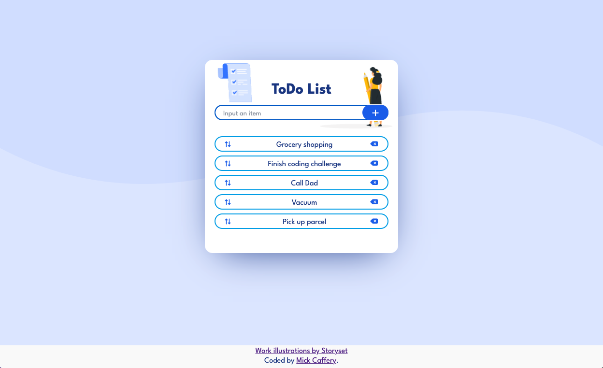
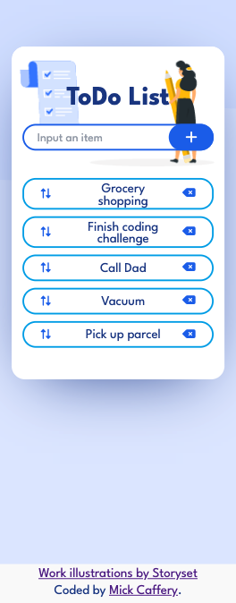

# Sortable Todo List - JavaScript

# In progress...

Introduce the app and why I built this...

## Table of contents

- [Sortable Todo List - JavaScript](#sortable-todo-list---javascript)
- [In progress...](#in-progress)
  - [Table of contents](#table-of-contents)
  - [Overview](#overview)
    - [The challenge](#the-challenge)
    - [Screenshot](#screenshot)
    - [Links](#links)
  - [My process](#my-process)
    - [Built with](#built-with)
    - [What I learned](#what-i-learned)
    - [Continued development](#continued-development)
  - [Style Guide](#style-guide)
    - [Font](#font)
  - [Useful resources](#useful-resources)
  - [Author](#author)
  - [Acknowledgements](#acknowledgements)

## Overview

### The challenge

Users should be able to:

- View the optimal layout for the app depending on their device's screen size

### Screenshot

Desktop View

Mobile View

### Links

- Solution URL: 
- Live Site URL: 

## My process

### Built with

- Semantic HTML5 markup
- CSS custom properties
- Mobile-first workflow

### What I learned

### Continued development

## Style Guide

### Font

- Family: [League Spartan](https://fonts.google.com/specimen/League+Spartan)
- Weights: 400, 500, 700

## Useful resources

-  - 

## Author

- GitHub - [Mick Caffery](https://github.com/mickcaff)
- [LinkedIn](https://www.linkedin.com/in/mcaffery/)

## Acknowledgements

- Pang
- Iryna
- Coder Academy

