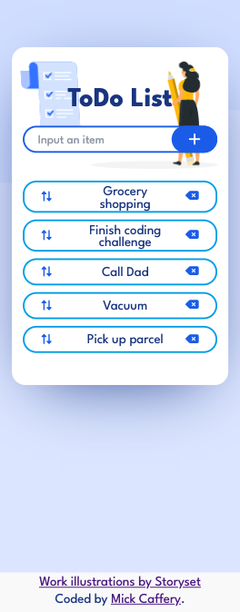

# Sortable To-Do List - JavaScript

This is a small sortable To-Do list that I completed in our 3rd week of learning JavaScript at the Coder Academy Web Development Bootcamp. 

I chose to build this project to help consolidate the content we have learnt in regards to DOM manipulation and Event Handling. The To-Do list can be sorted using Drag and Drop which was fun to implement.  

## Table of contents

- [Sortable To-Do List - JavaScript](#sortable-to-do-list---javascript)
  - [Table of contents](#table-of-contents)
  - [Overview](#overview)
    - [Links](#links)
    - [Screenshot](#screenshot)
  - [My process](#my-process)
    - [Built with](#built-with)
    - [What I learned](#what-i-learned)
    - [Continued development](#continued-development)
  - [Style Guide](#style-guide)
    - [Illustrations](#illustrations)
    - [Font](#font)
    - [Icons](#icons)
  - [Author](#author)
  - [Acknowledgements](#acknowledgements)

## Overview

Users should be able to:

- View the optimal layout for the app depending on their device's screen size
- Add & remove To-Do list items
- Sort items using Drag and Drop (only on desktop)

### Links

- Live Site URL: [https://fascinating-sprinkles-79de92.netlify.app/](https://fascinating-sprinkles-79de92.netlify.app/)

### Screenshot

Desktop View

Mobile View

## My process

### Built with

- Mobile-first workflow
- HTML5 markup
- CSS custom properties
- JavaScript
- Jest testing

### What I learned

I completed this small challenge to help consolidate JavaScript content that we have recently learnt in the Coder Academy Bootcamp.

My main goal for this challenge was to better learn how to implement the Drag and Drop feature. Key learnings that helped me implement this feature were:
- The different Drag and Drop events. [MDN Drag Event](https://developer.mozilla.org/en-US/docs/Web/API/Document/drag_event)
- I used the Element.before() & .after() methods to insert the dragged item into its new position. [MDN Element.before()](https://developer.mozilla.org/en-US/docs/Web/API/Element/before)

### Continued development

In the following weeks, we will be learning about connecting to third-party APIs, Promises & Classes.

Following on from that, we will be learning React, and I'll continue to attempt small projects and challenges like this one each week.

## Style Guide

### Illustrations

- Illustrations are from [Storyset](https://storyset.com/work)
- Free for personal and commercial purposes with attribution.

### Font

- Family: [League Spartan](https://fonts.google.com/specimen/League+Spartan)
- Weights: 400, 500, 700

### Icons

- Icons are from [FontAwesome](https://fontawesome.com/icons)

## Author

- GitHub - [Mick Caffery](https://github.com/mickcaff)
- [LinkedIn](https://www.linkedin.com/in/mcaffery/)

## Acknowledgements

- A big thanks to Pang & Iryna who are our class instructors at [Coder Academy](https://www.coderacademy.edu.au/)

